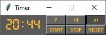

# Watch Yourself
Simple timer (Python, Pygame, Tkinter)

  

### General Information
I use a timer in my job. Concentrating on the task I hardly move for several hours. It's easy way to treat back pain, burning eyes,... In the timer, I can set a time interval after which I will be informed. Then I act.

### Technologies Used
* Pygame 2.1.2
* Python 3.10.4
* Tkinter 8.6

### PS
I made my first timer in [Python](https://github.com/SOS-RB1/Watch-Yourself). The second similar [(WY2)](https://github.com/SOS-RB1/Watch-Yourself-2) I did in a different technology to see the difference while creating and learning new things.
